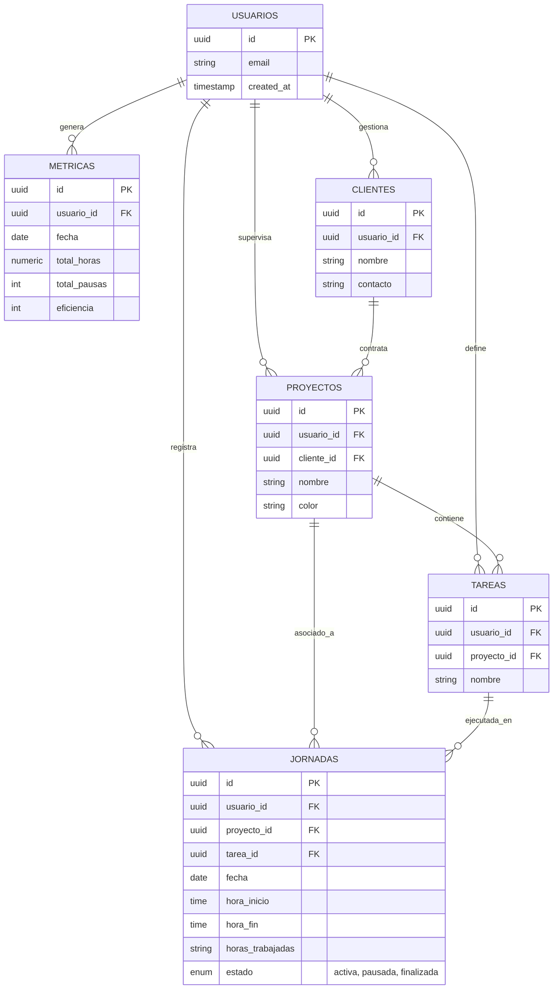

# ⏱️ TimeControl - Sistema Profesional de Control Horario


**TimeControl** es una solución empresarial de vanguardia para la gestión del tiempo y la productividad. Diseñada con una arquitectura robusta y una interfaz de usuario minimalista, permite a profesionales y empresas rastrear cada segundo de valor, desde la jornada laboral hasta la rentabilidad por cliente.

---

## 🚀 Características Principales

- ⚡ **Registro en Tiempo Real:** Control intuitivo de inicio, pausa y finalización de jornadas.
- 📊 **Analytics Avanzado:** Visualización dinámica de KPIs de rendimiento y métricas financieras.
- 📁 **Gestión de Entidades:** Estructura jerárquica de Clientes, Proyectos y Tareas.
- 📑 **Historial con Paginación:** Bitácora inteligente con segmentación de datos para alto rendimiento.
- 🌍 **Sincronización Cloud:** Respaldo y tiempo real impulsado por Supabase.
- ⌛ **Resiliencia Temporal:** Manejo inteligente de zonas horarias para evitar desfases de registro.

---

## 🏗️ Arquitectura de Datos (ERD)

El sistema utiliza una estructura relacional optimizada en PostgreSQL para garantizar la integridad y escalabilidad.



---

## 🛠️ Stack Tecnológico

| Capa | Tecnología |
| :--- | :--- |
| **Frontend** | React 18 (Hooks, Context API) |
| **Build Tool** | Vite |
| **Backend/DB** | Supabase (Postgres + Auth) |
| **Estilos** | CSS Moderno (Variables & Flexbox/Grid) |
| **Iconos** | Lucide React |
| **Gráficos** | Recharts |

---

## 📁 Estructura del Proyecto

```text
src/
├── components/
│   ├── common/        # Componentes UI Atómicos (Button, Modal, Card)
│   ├── dashboard/     # Widgets de métricas y visualización
│   └── layout/        # Shell de la aplicación (Sidebar, Header)
├── context/           # Gestión de estado global (AuthContext)
├── pages/             # Vistas: Dashboard, Jornada, Historial, Analytics
├── services/          # Capa de API/Supabase (Agnóstica a la UI)
└── styles/            # Sistema de diseño y tokens visuales
```

---

## ⚙️ Instalación Local

1. **Clonar e instalar:**
   ```bash
   git clone <repo-url>
   npm install
   ```

2. **Entorno:**
   Crea un `.env` con tus claves de Supabase:
   ```env
   VITE_SUPABASE_URL=tu_url
   VITE_SUPABASE_ANON_KEY=tu_key
   ```

3. **Base de Datos:**
   Ejecuta el script SQL incluido en `database/new_schema.sql` en tu dashboard de Supabase.

4. **Desarrollo:**
   ```bash
   npm run dev
   ```

---

## 🔍 Verificación Local (Antes de subir a Vercel)

Para asegurar que la aplicación funcione correctamente en producción, sigue estos pasos:

1. **Construir el proyecto:**
   ```bash
   npm run build
   ```
   Esto generará la carpeta `dist`. Si hay errores de importación (case-sensitivity), aquí aparecerán.

2. **Previsualizar la versión de producción:**
   ```bash
   npm run preview
   ```
   Abre el enlace proporcionado (usualmente `http://localhost:4173`). Navega por las rutas y refresca la página para verificar que el `vercel.json` y el enrutamiento SPA funcionen.

3. **Variables de Entorno en Vercel:**
   Asegúrate de configurar `VITE_SUPABASE_URL` y `VITE_SUPABASE_ANON_KEY` en el dashboard de Vercel.

---

> Hecho con ❤️ para una gestión del tiempo impecable.
