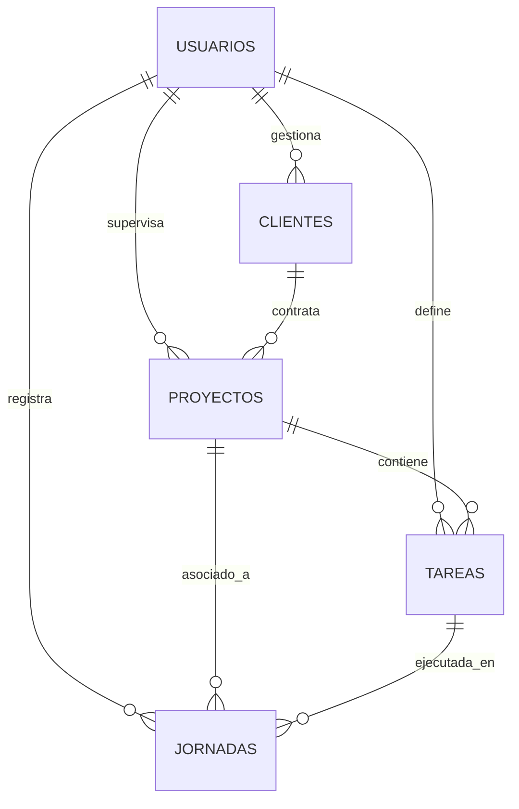

# ⏱️ TimeControl - Sistema Profesional de Control Horario


**TimeControl** es una solución empresarial de vanguardia para la gestión del tiempo y la productividad. Diseñada con una arquitectura robusta y una interfaz de usuario minimalista, permite a profesionales y empresas rastrear cada segundo de valor, desde la jornada laboral hasta la rentabilidad por cliente.

---

## 🚀 Características Principales

- ⚡ **Registro en Tiempo Real:** Control intuitivo de inicio, pausa y finalización de jornadas.
- 📊 **Analytics Avanzado:** Visualización dinámica de KPIs de rendimiento y métricas financieras.
- 📁 **Gestión de Entidades:** Estructura jerárquica de Clientes, Proyectos y Tareas.
- 📑 **Historial con Paginación:** Bitácora inteligente con segmentación de datos para alto rendimiento.
- 🌍 **Sincronización Cloud:** Respaldo y tiempo real impulsado por Supabase.
- ⌛ **Resiliencia Temporal:** Manejo inteligente de zonas horarias para evitar desfases de registro.

---

## 🧠 Sistema de Skills (RPSoft Standards)

Este proyecto implementa **AI Skills** para garantizar la excelencia operativa y técnica. Estas reglas son detectadas automáticamente por el asistente de desarrollo.

### 🎨 RPSoft UI — Identidad Visual
Garantiza un "Vibe" premium y consistente en toda la aplicación.
- **Tokens**: Uso de acento **Lime (#C5FF00)** y esquinas redondeadas de **12-16px**.
- **Regla de Oro del Tiempo**: 
  - **Uso Técnico**: Formato digital `HH:MM:SS` en todas las tablas y listas.
  - **Uso Ejecutivo**: Formato legible `179h 11m` en dashboards y KPIs superiores.
- **Componentización**: Se prohíbe el estilo inline; se debe usar el sistema atómico en `src/components/common`.

### 🔐 RPSoft Supabase — Database & Security
Define cómo interactuamos con la capa de datos de forma segura.
- **Security First**: RLS (Row Level Security) obligatorio en cada tabla mediante `auth.uid()`.
- **Arquitectura**: Lógica de base de datos aislada en `src/services/`.
- **Clean DB**: Nomenclatura plural para tablas y `snake_case` para campos, con timestamps de auditoría.

---

## 🏗️ Arquitectura de Datos (ERD)



---

## 🛠️ Stack Tecnológico

| Capa | Tecnología |
| :--- | :--- |
| **Frontend** | React 18 (Hooks, Context API) |
| **Build Tool** | Vite |
| **Backend/DB** | Supabase (Postgres + Auth) |
| **Estilos** | CSS Moderno (Variables & Flexbox/Grid) |
| **Iconos** | Lucide React |
| **Gráficos** | Recharts |

---

## 📁 Estructura del Proyecto

```text
src/
├── components/        # Componentes UI Atómicos (Button, Modal, Card)
├── context/           # Gestión de estado global (AuthContext)
├── pages/             # Vistas principales y lógica de página
├── services/          # Capa de API/Supabase centralizada
└── styles/            # Sistema de diseño y tokens visuales
```

---

## ⚙️ Instalación Local

1. **Clonar e instalar:**
   ```bash
   npm install
   ```

2. **Entorno:**
   Configura el archivo `.env` con `VITE_SUPABASE_URL` y `VITE_SUPABASE_ANON_KEY`.

3. **Ejecutar:**
   ```bash
   npm run dev
   ```

---

> Hecho con ❤️ por RPSoft para una gestión del tiempo impecable.
