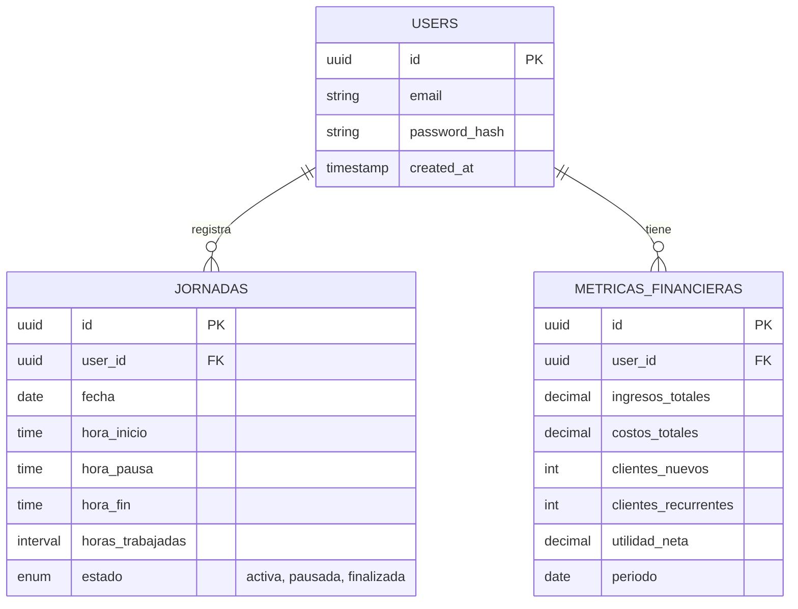

# Control Horario App - Sistema de Asistencia de Personal

Sistema web moderno para la gestión de jornadas laborales, control de entrada/salida y visualización de métricas financieras de proyectos. Desarrollado con React, Vite y Supabase.

## 🚀 Inicio Rápido

### Prerrequisitos
- Node.js 18+
- npm o yarn
- Cuenta en Supabase

### Instalación

1. Clona el repositorio e instala las dependencias:
```bash
git clone <tu-repo-url>
cd BaseAsistance
npm install
```

2. Configura las variables de entorno:
```bash
cp .env.example .env
```
Edita el archivo `.env` con tus credenciales de Supabase:
```
VITE_SUPABASE_URL=tu_url_de_supabase
VITE_SUPABASE_ANON_KEY=tu_anon_key
```

3. **Inicializa la Base de Datos:**
Ejecuta el script SQL en el Editor SQL de tu dashboard de Supabase para crear las tablas y datos de prueba:
`database/init_schema.sql`

4. Inicia el servidor de desarrollo:
```bash
npm run dev
```

5. Abre http://localhost:5173 en tu navegador.

## 🏗️ Arquitectura y Base de Datos

### Diagrama Entidad-Relación (ERD)



### Descripción de Tablas

1. **USERS**: Gestiona la identidad de los usuarios (vinculado a Supabase Auth).
2. **JORNADAS**: Registra el control diario de asistencia.
   - `estado`: Puede ser `activa` (en curso), `pausada` (descanso) o `finalizada`.
   - `horas_trabajadas`: Calculado automáticamente al finalizar la jornada.
3. **METRICAS_FINANCIERAS**: Almacena datos para el dashboard de rendimiento.
   - Incluye ingresos, costos y análisis de clientes (nuevos vs recurrentes).

## 📁 Estructura del Proyecto

```
src/
├── components/
│   ├── auth/          # Login, Signup, ProtectedRoute
│   ├── common/        # UI Kit (Button, Input, Card, Modal)
│   ├── dashboard/     # Widgets de métricas y gráficos
│   ├── jornadas/      # Controles de asistencia (Iniciar, Pausar, Fin)
│   └── layout/        # Estructura principal (Header, Sidebar)
├── context/           # Estado global (AuthContext, JornadaContext)
├── pages/             # Vistas (Login, Dashboard, Historial)
├── services/          # Comunicación con Supabase (API)
├── styles/            # Variables CSS y estilos globales
└── utils/             # Helpers de fecha y validaciones
```

## 🛠️ Tecnologías

- **Frontend:** React 18, Vite, React Router
- **Backend:** Supabase (PostgreSQL, Auth, RLS)
- **Visualización:** Recharts (Gráficos), Lucide React (Iconos)
- **Estilos:** CSS Modules / Vanilla CSS moderno

## 📝 Funcionalidades Principales

- ✅ **Autenticación:** Registro e inicio de sesión seguro.
- ✅ **Control de Asistencia:**
  - Registro de entrada con un click.
  - Pausa para refrigerio.
  - Cierre de jornada con cálculo automático de horas.
- ✅ **Dashboard Financiero:**
  - Visualización de ingresos vs egresos.
  - KPI de utilidad neta.
  - Retención de clientes.
- ✅ **Historial:** Bitácora completa de jornadas pasadas.
