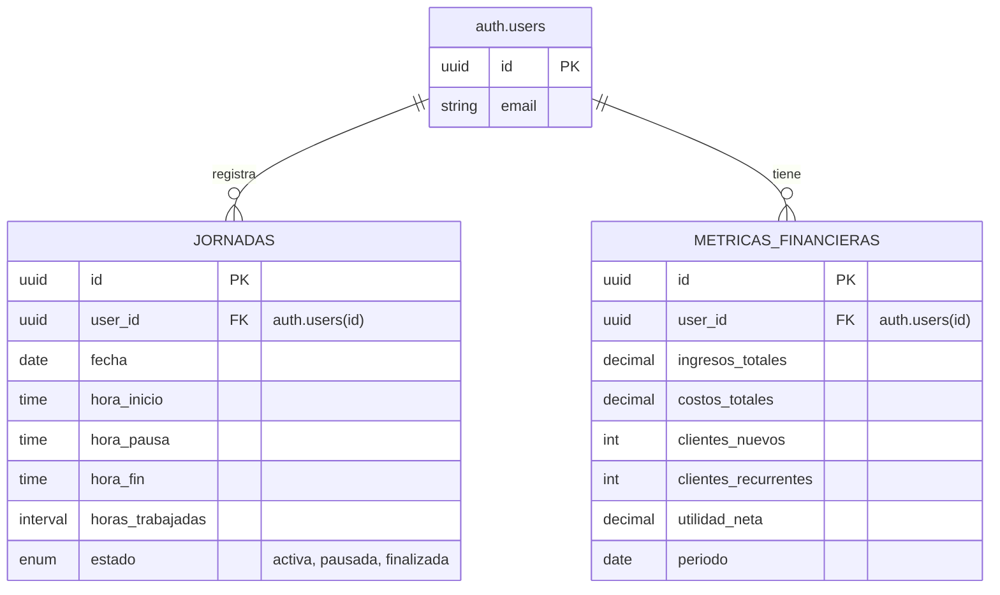

# Control Horario App - Sistema de Asistencia de Personal

Sistema web moderno para la gestión de jornadas laborales, control de entrada/salida y visualización de métricas financieras de proyectos. Desarrollado con React, Vite y Supabase.

## 🚀 Inicio Rápido

### Prerrequisitos
- Node.js 18+
- npm o yarn
- Cuenta en Supabase

### Instalación

1. Clona el repositorio e instala las dependencias:
```bash
git clone <tu-repo-url>
cd BaseAsistance
npm install
```

2. Configura las variables de entorno:
```bash
cp .env.example .env
```
Edita el archivo `.env` con tus credenciales de Supabase:
```
VITE_SUPABASE_URL=tu_url_de_supabase
VITE_SUPABASE_ANON_KEY=tu_anon_key
```

3. **Inicializa la Base de Datos:**
Ejecuta el script SQL en el Editor SQL de tu dashboard de Supabase para crear las tablas y datos de prueba:
`database/init_schema.sql`

4. Inicia el servidor de desarrollo:
```bash
npm run dev
```

5. Abre http://localhost:5173 en tu navegador.

## 🏗️ Arquitectura y Base de Datos

### Diagrama Entidad-Relación (ERD)



### Descripción de Tablas

1. **Supabase Auth**: Gestiona la identidad de los usuarios de forma nativa.
2. **JORNADAS**: Registra el control diario de asistencia vinculado al `auth.uid()`.
   - `estado`: Puede ser `activa`, `pausada` o `finalizada`.
3. **METRICAS_FINANCIERAS**: Almacena datos para el dashboard de rendimiento.

## 📁 Estructura del Proyecto

```
src/
├── components/
│   ├── dashboard/     # Widgets (StatsCard, Tracker, Charts)
│   ├── layout/        # Estructura principal (Layout, Sidebar, Header)
│   └── ui/            # UI Kit Atómico (Button, Card, Input, Table)
├── context/           # Estado global (AuthContext)
├── lib/               # Configuración (supabase.js unificado)
├── pages/             # Vistas (Login, Signup, Dashboard, Jornada, Historial)
├── services/          # Capa de Servicios (auth, jornadas, metricas)
└── styles/            # Tailwind CSS y globales
```

## 🛠️ Tecnologías

- **Frontend:** React 18, Vite, Tailwind CSS (Estándar UI)
- **Backend:** Supabase (Auth, PostgreSQL, Row Level Security)
- **Componentes:** Diseño Atómico (Atomic Design)
- **Visualización:** Recharts, Lucide Icons

## 📝 Funcionalidades (Sprint 1)

- ✅ **UI Modernizada:** Interfaz SaaS profesional utilizando Tailwind CSS.
- ✅ **Componentes Reutilizables:** Librería base de UI para consistencia visual.
- ✅ **Seguridad RLS:** Protección de datos a nivel de fila (cada usuario solo ve sus datos).
- ✅ **Cliente Unificado:** Inicialización de Supabase centralizada y robusta.
- ✅ **Control de Asistencia:** Flujo completo de jornada laboral.
- ✅ **Dashboard en tiempo real:** Visualización de KPIs financieros.
